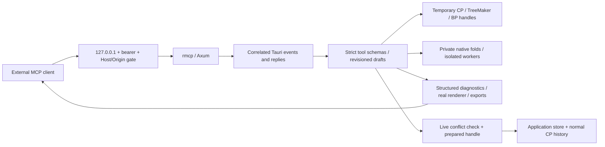

# Desktop MCP architecture

## Boundary and ownership

The desktop process owns a Streamable HTTP MCP server using Rust `rmcp` and
Axum. The renderer owns the semantic tool catalog and automation service.
There is no server on the hosted web app and no dependency on browser automation.

[`openscad-studio`'s desktop MCP implementation](https://github.com/zacharyfmarion/openscad-studio)
informed the desktop/renderer request bridge. Ori Studio uses a different
mutation model: serialized structured documents, revisioned experiments,
temporary engine handles, semantic atomic batches and explicit publication.
Text replacement or exposing arbitrary Zustand setters cannot preserve this
application's compound canvas history.

The MCP protocol follows
[Streamable HTTP](https://modelcontextprotocol.io/specification/2025-11-25/basic/transports).
Transport is stateless; experiments and receipts are explicit application
resources shared within one enabled renderer session. No transport session
database or ever-growing abandoned-client registry is needed.

## Code map

| Module | Responsibility |
| --- | --- |
| `apps/tauri/src-tauri/src/mcp/mod.rs` | Opt-in listener, authentication, request correlation, lifecycle, limits |
| `apps/tauri/src-tauri/src/mcp/folding.rs` | Private native CP sessions and independent cooperative cancellation |
| `apps/web/src/automation/tools.ts` | Single tool/schema catalog, bounded typed operations, Ajv validation |
| `automation/desktopBridge.ts` | Renderer generation and native request/reply bridge |
| `automation/service.ts` | Drafts, revisions, checkpoints, receipts, queues, jobs and publication coordination |
| `automation/engines.ts` | Existing kernel adapters and temporary-handle lifetime |
| `automation/analysis.ts` | Local checks, native layer search, optimizer and simulator workers |
| `automation/render.ts`, `export.ts` | Existing renderers and serializers, returned content rather than host writes |
| `store/workspaceStore/slices/automationSlice.ts` | Conflict-checked application publication |
| `store/workspaceStore/operationFence.ts` | Prevent publication during an existing asynchronous application action |
| `components/settings/McpSection.tsx`, `platform/mcpService.ts` | Session access controls and secret configuration disclosure |

The server advertises the same schemas the renderer validates. Every object
rejects extra properties. There is no command-name passthrough, raw store patch,
evaluation, JavaScript execution, generic Tauri invocation, network request or
host filesystem tool. The application remains usable without enabling MCP.

## Transaction lifecycle

A draft stores a serialized immutable model snapshot. Each edit loads that state
into a temporary real engine handle, runs its semantic batch, serializes the
result, validates it and frees the handle. Only a successful complete operation
replaces the draft snapshot. A later failing command cannot expose an earlier
command's partial work. TreeMaker and BP use their public formats; BP uses the
session serializer so stretch selections survive experiment snapshots.

Drafts have monotonically increasing revisions, immutable checkpoints and a
single active job. Operations addressing line IDs cannot follow topology changes
inside the same batch. Exact-revision checks also apply to inspection and
artifacts. No-op edits do not advance revision. Rollback restores content with a
new revision. This intentionally avoids pretending transient kernel IDs are
persistent identities across topology reconstruction.

The experiment captures a private live CP base: document reference, edit revision,
history stacks, annotations, folded figures, inline simulations, extensions and
pins. These references never cross the wire. Commit checks the base, prepares a
replacement native/wasm handle without touching the active document, checks again,
then installs the handle and updates the store synchronously in one turn. It
retains/releases folded-figure references using the normal history ownership
rules, drops redo entries, caps history normally and schedules CAMV refresh.

Comparing completed store snapshots alone is insufficient: a user action might
have captured the old runtime handle and be awaiting an engine result. The
operation fence tracks pending asynchronous store actions and refuses publication
while any are active. Existing action signatures and behavior are preserved.
The before/after preparation checks prevent both stale-base commits and commits
after access revocation or request cancellation. GUI state remains authoritative.

TreeMaker/BP publication adds a new tab through the design-handle registry and
normal hydration. It never overwrites an existing tree tab. The Edit canvas has
one-step undo/redo through MCP; added tree tabs are removed through the normal
tab-close UI. Draft rollback remains available for all design kinds.

## Jobs and cancellation

Jobs return immediately and carry the analyzed revision. Successful TreeMaker
optimization/build publishes back only into its unchanged draft. Failed or
cancelled jobs cannot publish late results. Status and cancellation bypass the
serialized ordinary-request queue. Artifacts are tied to their original revision.

TreeMaker optimization and simulation use dedicated workers. Termination does
not invalidate the user's live handles. The simulator runs the application's
CPU reference backend and exports its real mesh/camera views.

Desktop layer search uses a private Rust `CpSession` per job, outside the user's
`CpEngine` mutex. Its cancellation flag is independent of both other jobs and
the interactive fold command. A native deadline remains effective if the
renderer disappears. The existing solver's cooperative cancellation points are
reused; no folding algorithms are changed. Other short kernel operations can
finish their current call before cancellation is observed; timeout prevents their
results from publishing but cannot forcibly interrupt arbitrary native code.

The renderer service expires idle drafts and bounds drafts (8), checkpoints per
draft (8), jobs (32), semantic operations per batch (128), CP lines (20,000),
ordinary queued requests (16), mutation receipts (256), input (8 MiB), draft/job
serialization (32 MiB), responses (16 MiB), and retained serialized state/receipt
admission (64 MiB). These serialization budgets are not an OS heap quota; engine
transient memory and a finishing response have additional overhead. Old work
should be exported and discarded. Receipt IDs are never silently evicted and
re-executed. Drafts expire after 30 minutes idle, jobs after 120 seconds, ordinary
execution after 25 seconds and transport replies after 30 seconds. Native folds
have a separate concurrency cap of two. Current limits are discoverable.

An ordinary timeout cancels the operation's publication permission. A transport
timeout can also include queue delay and is reported as an indeterminate outcome:
retry the same request ID. Live undo/redo cannot be interrupted after the existing
application history action begins, so its receipt remains pending instead of
claiming rollback. Successful mutation receipts are retained across reconnects.
Renderer restarts or access revocation terminate that receipt namespace.

## Security and privacy

- Bind only IPv4 loopback. There is no bind-address option or remote-access mode.
- Require bearer authentication, exact `Host: 127.0.0.1:port`, and reject every
  browser `Origin`, including `null` and loopback origins. No CORS permission is
  granted. A website cannot use an enabled local endpoint as a browser API.
- Generate an unpredictable token for each grant, unless the owner explicitly
  supplies a test token. Do not log it or persist it. The UI hides it until
  requested. There is no arbitrary host execution or path-based read/write tool.
- Bound HTTP bodies and body-read time; bound pending correlated requests.
  Dropping a transport request releases its correlation slot. Disable/reload
  clears pending replies; generation IDs refuse replies from an old renderer.
- Only the main trusted webview can use the native bridge commands. Native
  layer-search jobs require an enabled grant and a prepared private job ID.
- Disabling access closes the gate immediately and cancels jobs. It cannot undo
  an already completed live commit; that uses normal application history.
- Product analytics use the central consent-aware `track` layer. Only tool-name,
  success/error and enabled/disabled enums are sent. Arguments, geometry, titles,
  file content, images, tokens, IDs and diagnostic messages are never event
  properties. The agent receives user-authorized document content over MCP.

Loopback authentication protects against unrelated local clients and browser
origins. It is not isolation from an attacker already controlling the same user
account or the trusted renderer. Nor can a server retract data already exported
to an authorized external agent. These are boundaries of the chosen desktop model.

## Extending the surface

Add a semantic operation to the schema catalog, adapt an existing engine or
application abstraction, and test failed batches and revision behavior. Keep
engine algorithms in their existing modules with their upstream parity rules.
New asynchronous work must own its cancellation/lifetime and return artifacts
bound to a revision. Add a real client probe for any new tool family.

No vendored code or kernel algorithm was changed for MCP. The three excluded
issues are deliberately isolated: all-negative-y FOLD and zero-height FOLD inputs
are refused with the issue numbers; ORH import is not exposed. CP/ORI interchange
provides a workaround without silently rewriting upstream import semantics.
