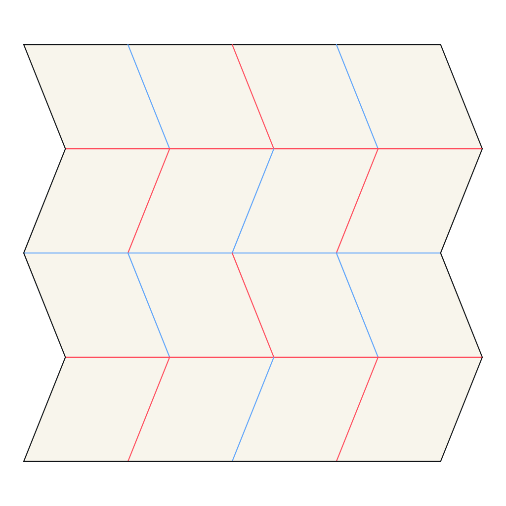
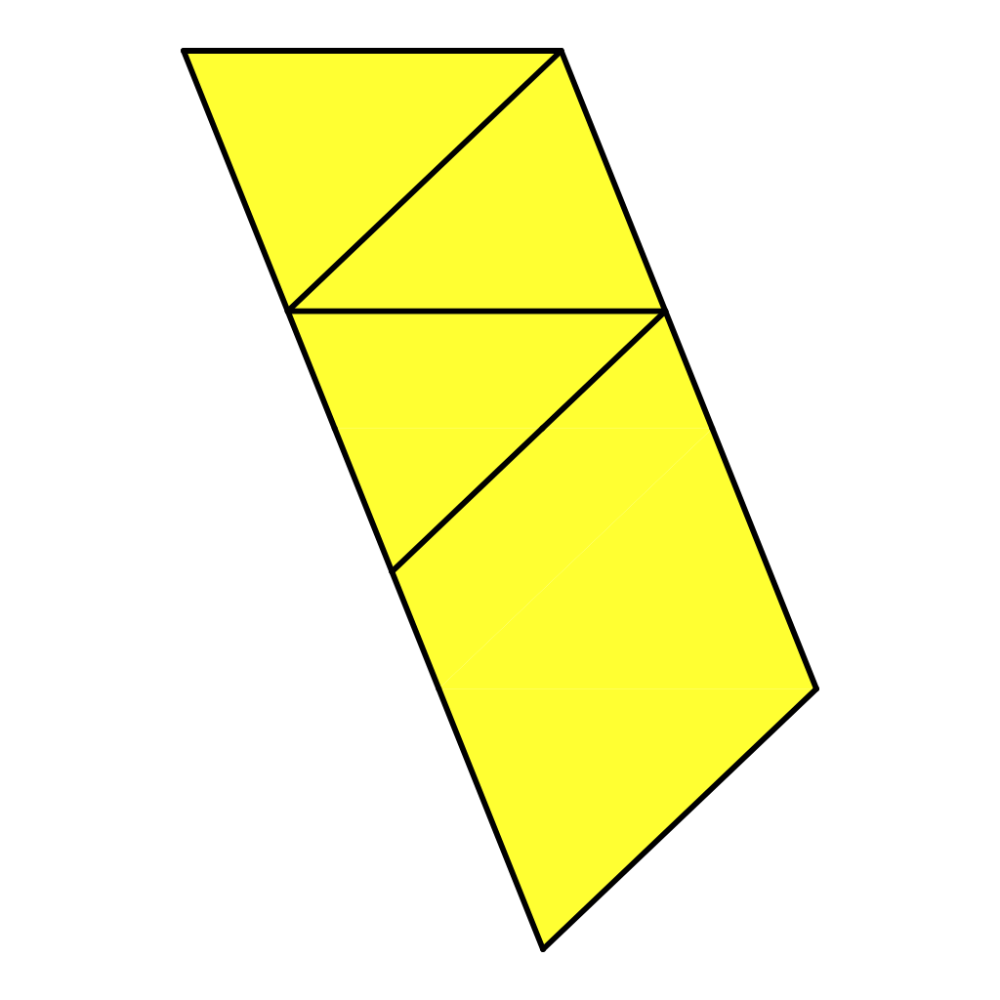

# MCP implementation report

Ori Studio now has a desktop MCP surface for autonomous origami experiments:
19 discoverable tools covering structured authoring, local diagnostics, layer
search, physical simulation, visual feedback, recovery and editable export.
The opt-in server is authenticated and loopback-only. CP publication is one
conflict-checked action in the application's existing undo history.

The implementation is on `feat/mcp-agent-integration` in
[`amatouhake/ori-studio`](https://github.com/amatouhake/ori-studio/tree/feat/mcp-agent-integration).
No upstream pull request is opened. The user can inspect and exercise this branch
before choosing whether to propose it upstream.

See [the hardening report](hardening.md) for subsequent correctness fixes and
independent blind-agent evaluations. The original simulation measurements below
are historical pipeline evidence only; they do not demonstrate a 55% fold.

## Autonomous client evidence

Validated on Linux with the real Tauri desktop under Xvfb, using bundled
production web assets and the official JavaScript MCP SDK over HTTP. The desktop
used separate temporary app data. All origami actions were MCP calls; the client
did not invoke internal store methods or drive application controls. The scripts
are deterministic clients demonstrating the contract, not an LLM benchmark.

`scripts/mcp/desktop-demo.mjs` launches a fresh desktop, generates a private
credential, waits for an MCP handshake, runs all probes, and stops the app. See
[the reproducible setup](README.md#reproduce-the-demonstration).

| Miura acceptance step | Measured result |
| --- | --- |
| Create from an empty/simple project | 25 vertices, 40 segments, 16 panels, authored through crease operations |
| Initial Oriedita checks | 0 diagnostic entries |
| Intentionally change an interior valley to mountain | 14 diagnostic entries |
| Examine returned PNG | Red ink increased from 6,704 to 7,294 pixels; blue decreased from 10,130 to 9,621 |
| Re-inspect IDs and repair the assignment | 0 diagnostic entries; image measurements restored exactly |
| Native layer-order solve | `Solved` |
| Original simulation request 0.55 (superseded) | Reached only 0.55%, owing to a unit bug; convergence proved execution, not a 55% fold |
| Simulation strain/velocity | Maximum nodal strain `1.0847314e-5`, maximum edge strain `1.9550312e-5`, maximum velocity `9.7202092e-6` |
| Simulation diagnostics | No errors or warnings |
| Export | OSF, CP, ORI, FOLD, SVG, PNG and simulated OBJ |
| Commit and history | One CP history entry; MCP undo restored the prior canvas and redo restored all 40 segments |

The client uses returned structured diagnostics and pixel measurements to detect
and correct the intentionally introduced problem. Its image-decoding browser
never connects to the application. A vision-capable agent receives the same
standard MCP PNG content and can inspect it directly.

The original near-flat simulation image is superseded by the corrected target
validation in [the hardening report](hardening.md).

Additional real MCP probes cover:

- **TreeMaker:** create a four-leaf tree from scratch, add a corner constraint,
  checkpoint/rollback, run ALM scale optimization (0.1 → 0.4999979217), build a
  complete CP, derive 16 editable CP segments, publish a new design tab and
  round-trip TMD5. Both TMD5 and OSF are exported.
- **Box pleating:** initialize a three-leaf tree, position its flaps, verify a
  valid packing, derive 28 CP segments, publish a new design tab and round-trip
  BPS. Both BPS and OSF are exported.
- **Transactions:** an insertion followed by an invalid reference leaves all
  original CP content/revision intact. Retrying identical mutation arguments
  returns the same receipt. Checkpoints restore earlier model content.
- **Construction:** preview three triangle bisectors in the requested valley
  color, verify the preview has no mutation, then commit the construction.
- **Transport:** authenticated discovery succeeds; missing/wrong tokens return
  401, website/null/loopback Origins and a mismatched Host return 403, and bodies
  exceeding 8 MiB return 413. The Host probe uses `node:http` to send the header
  verbatim; Fetch would normalize it and invalidate the test.

Checked-in [Miura results](evidence/miura-report.json),
[design-engine results](evidence/design-engines-report.json), and
[editable Miura OSF](evidence/miura.osf) preserve a compact review record. Fresh
runs write complete transcripts and all artifacts to ignored `artifacts/mcp-*`.
These files were generated by the demonstration; no private user corpus was used.

## Validation

| Check | Result |
| --- | --- |
| Web unit suite | 480 files, 6,026 tests passed |
| Focused final automation/store/Settings suite | 3 files, 14 tests passed |
| Web lint and TypeScript | Passed |
| Translation parity and source hashes | Passed; Settings copy translated into all eight target locales |
| `npm run build:web` | Passed, including all four WASM bridges, simulator and landing prerender |
| `cargo fmt --check` | Passed |
| `cargo test -p ori-studio --lib` | 23 tests passed |
| `cargo clippy -p ori-studio --all-targets -- -D warnings` | Passed; existing workspace lint configuration emits an unknown-lint warning on this installed toolchain |
| `npm run check:desktop` and desktop binary build | Passed |
| Real desktop MCP probes | Miura acceptance, TreeMaker/BP/transaction/construction probe, and HTTP security probe passed |
| Settings UI | Disclosure/revocation and browser-exclusion tests passed; desktop/narrow screenshots reviewed with no material UI findings |

The production build retains existing large-chunk warnings. The web suite emits
existing jsdom canvas/navigation notices. Headless WebKit emits graphics warnings
under Xvfb; the real render and simulation probes succeed despite those notices.

Full Rust workspace/oracle suites were not rerun: no kernel algorithms, parsers,
serializers or vendored upstream source changed. The relevant desktop crate,
all WASM builds, web suite and real engine flows were exercised instead. No
macOS/Windows packaging, signing, or native UI session was available in this
Linux environment. The shared implementation uses Tauri's platform abstractions;
cross-platform runtime validation remains a follow-up.

## Deliberate boundaries and remaining limitations

- Desktop only, with a running renderer. There is no remote server, hosted-web
  endpoint, arbitrary code execution, shell access or path-based file access.
- Experiments and request receipts are session-local. Export before disabling
  access/restarting. Limits are discoverable; a stalled native call may finish
  its current operation before cancellation is observed, but cannot publish its
  expired result. Native layer search has independent cooperative cancellation
  and a native deadline; optimizer/simulator workers can be terminated.
- CP commits replace geometry while retaining live companion objects and use
  one normal undo entry. TreeMaker/BP commits create new tabs, preserving existing
  tabs; the added tab can be closed in the UI. MCP does not replace existing tree
  tabs, merge concurrent user edits, or force a stale CP commit.
- Annotation/reference-image creation, detector inference, circle authoring,
  camera manipulation of live UI panels, and insertion of new live folded-figure
  or inline-simulation canvas objects are not exposed. Active CP clones preserve
  existing companions in OSF. Analysis/simulation results are returned as
  structured data and rendered/exported artifacts. This surface is focused on
  autonomous geometric origami design rather than every UI command.
- Model images use real application renderers, not desktop screenshots. Simulation
  uses the actual CPU reference backend; it is a physical feedback signal, not a
  proof of global foldability or collision-free motion. Flat layer solving is a
  distinct analysis. Standard-base generators retain upstream assignment behavior.
- MCP imports CP/ORI/FOLD/TMD5/BPS; OSF is exported and reopened through the normal
  application Open flow. Interchange formats omit unsupported canvas metadata.
- FOLD import relies on the importer's normalization of all-negative-y and
  single-axis geometry ([#366](https://github.com/zacharyfmarion/ori-studio/issues/366),
  [#367](https://github.com/zacharyfmarion/ori-studio/issues/367)); the MCP guard
  only rejects structurally unusable files. ORH import is not advertised
  ([#368](https://github.com/zacharyfmarion/ori-studio/issues/368)).

The [architecture document](architecture.md) describes ownership, security,
lifetimes, transaction guards and extension points. The
[agent guide](README.md) contains connection details and the external workflow.
